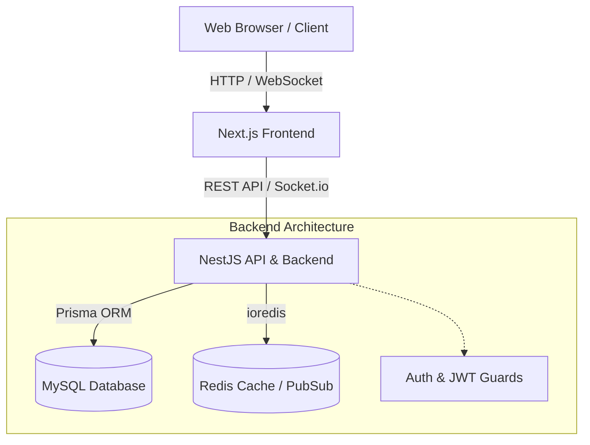

# 🏦 FinanceHub - Digital Banking Dashboard Simulator

<div align="center">


**A modern fintech dashboard simulator designed for portfolio demonstration and product design showcase.**

**Author:** Mahmoud Bousbih

</div>

---

## 🎯 Overview

FinanceHub is a full-stack digital banking simulator built to showcase modern fintech application design and engineering practices. It includes secure authentication, multi-account management, virtual cards, transfers, deposits, withdrawals, currency exchange, notifications, analytics, Smart Savings Vaults, and an admin supervision panel.

The project focuses on a polished UI/UX, modular architecture, secure workflows, and a realistic banking-style experience.

> ⚠️ **This is a simulator.** No real financial transactions are processed.

---

## ✨ Features

| Feature | Description |
|---------|-------------|
| 🔐 **Authentication & Security** | JWT-based auth, refresh token rotation, 2FA/OTP simulation, active sessions, audit logs |
| 💰 **Accounts & Vaults** | Multiple virtual accounts and Smart Savings Vaults with round-up spare change simulation |
| 💳 **Virtual Cards** | Interactive virtual cards with create, block, activate, and limit management flows |
| 💸 **Transfers & Split Bill** | Internal transfers with fee calculation and split-bill request tracking |
| 📊 **Dashboard & Insights** | Financial overview with analytics, summaries, and rule-based insight simulation |
| 📈 **Investments Portfolio** | Simulated crypto and stocks portfolio using mock market data |
| 💱 **Exchange** | Currency conversion with multiple supported currencies |
| 🎁 **Rewards System** | Loyalty tiers and cashback points tracking |
| 🔔 **Notifications** | In-app notifications with unread states and system events |
| 🛡️ **Admin Panel** | User management, audit logs, transaction supervision |
| 📱 **Responsive UI/UX** | Premium fintech-inspired design with smooth responsive behavior |

---

## 🛠️ Tech Stack

### Frontend
- **Next.js 14** (App Router) + **TypeScript**
- **TailwindCSS** + **shadcn/ui**
- **Framer Motion** for smooth motion and transitions
- **TanStack Query** for server state
- **Zustand** for client state
- **Recharts** for data visualization
- **Zod** + **React Hook Form** for validation
- **Socket.io** client for real-time updates

### Backend
- **NestJS** + **TypeScript**
- **Prisma ORM** + **MySQL**
- **Redis** for caching and performance optimization
- **JWT** authentication with refresh token rotation
- **Swagger/OpenAPI** documentation
- **Socket.io** for WebSocket communication
- **bcryptjs** for password hashing

### DevOps
- **Docker** + **Docker Compose**
- **GitHub Actions** CI/CD
- **Turborepo** monorepo management

---

## 📁 Project Structure

```
finance-dashboard/
├── apps/
│   ├── web/              # Next.js Frontend
│   │   └── src/
│   │       ├── app/      # Pages (App Router)
│   │       ├── components/  # UI Components
│   │       ├── lib/      # Utilities & API
│   │       └── store/    # Zustand stores
│   └── api/              # NestJS Backend
│       ├── prisma/       # Schema & migrations
│       └── src/
│           ├── common/   # Prisma, Redis
│           └── modules/  # Feature modules
├── docker/               # Docker configs
├── .github/workflows/    # CI/CD
└── docs/                 # Documentation
```
---

## 🏗️ Architecture Diagram


---

## 🧠 Architecture Decisions

- **Next.js** was chosen for the frontend because it provides a modern React framework with strong routing, server rendering, and excellent developer experience.
- **NestJS** was chosen for the backend because it supports modular architecture, dependency injection, and enterprise-style code organization.
- **Prisma** was chosen for type-safe database access and clean relational modeling.
- **MySQL** was chosen for structured financial data, consistency, and relational integrity.
- **Redis** was chosen for caching, temporary session-like data, and performance optimization.
- **Turborepo** was chosen to manage the monorepo and share code efficiently between frontend and backend.
- **JWT with refresh token rotation** was chosen to provide a secure authentication strategy.
---

## 📸 Screenshots

> ✨ A visual walkthrough of FinanceHub — from onboarding to advanced financial operations.  
> Built with a premium fintech aesthetic, smooth interactions, and a refined user experience.

### 🌐 Public Experience

<table>
  <tr>
    <td align="center" width="50%">
      <strong>Landing Page</strong><br/>
      
      <p><em>Elegant marketing page with premium branding and onboarding flow.</em></p>
    </td>
    <td align="center" width="50%">
      <strong>Login Page</strong><br/>
      
      <p><em>Secure and smooth login experience with modern UI patterns.</em></p>
    </td>
  </tr>
</table>

### 📊 Dashboard Experience

<table>
  <tr>
    <td align="center" width="50%">
      <strong>Full Dashboard — Dark Mode</strong><br/>
      
      <p><em>Immersive dark mode with financial insights and analytics.</em></p>
    </td>
    <td align="center" width="50%">
      <strong>Dashboard Overview</strong><br/>
      
      <p><em>Real-time financial summary, charts, and quick actions.</em></p>
    </td>
  </tr>
</table>

### 💳 Banking Features

<table>
  <tr>
    <td align="center" width="50%">
      <strong>Accounts Management</strong><br/>
      
      <p><em>Multi-account overview with balances and analytics.</em></p>
    </td>
    <td align="center" width="50%">
      <strong>Virtual Cards</strong><br/>
      
      <p><em>Interactive 3D cards with realistic fintech UI.</em></p>
    </td>
  </tr>
  <tr>
    <td align="center" width="50%">
      <strong>Transfers</strong><br/>
      
      <p><em>Seamless money transfer flow with validation and UX clarity.</em></p>
    </td>
    <td align="center" width="50%">
      <strong>Transactions History</strong><br/>
      
      <p><em>Detailed transaction tracking with filters and insights.</em></p>
    </td>
  </tr>
  <tr>
    <td align="center" width="50%">
      <strong>Deposit & Withdrawal</strong><br/>
      
      <p><em>Core banking operations with intuitive user flows.</em></p>
    </td>
    <td align="center" width="50%">
      <strong>Currency Exchange</strong><br/>
      
      <p><em>Real-time currency conversion with visual feedback.</em></p>
    </td>
  </tr>
</table>

### 📈 Advanced Features

<table>
  <tr>
    <td align="center" width="50%">
      <strong>Investments & Crypto</strong><br/>
      
      <p><em>Simulated investment portfolio with interactive charts.</em></p>
    </td>
    <td align="center" width="50%">
      <strong>Smart Savings Vaults</strong><br/>
      
      <p><em>Goal-based savings with progress tracking and automation.</em></p>
    </td>
  </tr>
</table>

### 🔔 User Experience

<table>
  <tr>
    <td align="center" width="50%">
      <strong>Notifications</strong><br/>
      
      <p><em>Real-time alerts and system notifications.</em></p>
    </td>
    <td align="center" width="50%">
      <strong>Profile & Security</strong><br/>
      
      <p><em>User profile management with advanced security settings.</em></p>
    </td>
  </tr>
  <tr>
    <td align="center" width="50%">
      <strong>Settings & Security Center</strong><br/>
      
      <p><em>Full control over preferences, sessions, and security.</em></p>
    </td>
    <td align="center" width="50%">
      <strong>—</strong><br/>
      <p><em></em></p>
    </td>
  </tr>
</table>
---

## 🔄 Core Business Flows

### Transfer Flow
1. Validate user input with frontend and backend validation.
2. Check sender account balance.
3. Calculate fees and verify limits.
4. Create a pending transfer record.
5. Execute the balance update atomically.
6. Create the transaction entry.
7. Send a realtime notification.
8. Write an audit log entry.

### Exchange Flow
1. Select source and target currencies.
2. Load the current exchange rate.
3. Preview the converted amount.
4. Verify account balance.
5. Execute the conversion.
6. Record the transaction and exchange history.
7. Notify the user and log the action.

### Card Management Flow
1. Create a virtual card linked to an account.
2. Mask sensitive card information.
3. Allow activate, block, and freeze actions.
4. Track card status changes in audit logs.
---

## 🗄️ Database Schema

The Prisma schema includes 15 models with proper relations, indexes, and constraints:
- User, RefreshToken, PasswordResetToken, EmailVerificationToken
- Account, Card, Beneficiary, Vault, SplitRequest
- Transfer, Transaction, Deposit, Withdrawal
- ExchangeRate, ExchangeHistory
- Notification, AuditLog
---

## 🔒 Security

- JWT access tokens (15min expiry)
- Refresh token rotation with hashed storage
- bcrypt password hashing (12 rounds)
- Rate limiting (100 req/60s)
- RBAC authorization guards
- Input validation with class-validator
- Helmet security headers
- CORS strict configuration
- Audit trail for sensitive actions
- No storage of CVV, raw PAN, or plain passwords
---

## ⚠️ Limitations

- This project is a simulator and does not process real banking transactions.
- No real payment gateway is integrated.
- Currency exchange rates may be mocked or cached for demonstration purposes.
- AI-related insights are rule-based simulations unless connected to a real AI service.
- 3D card visuals are part of the UI experience and not connected to a physical payment system.
---

## 🧪 Testing

- Unit tests with Jest
- API integration tests with Supertest
- Frontend component tests where applicable
- Validation and business logic testing for authentication, transfers, and account updates
---

## 🌍 Live Demo

- Frontend: [https://financehub-demo.vercel.app  ](https://financehub-web-one.vercel.app/)

- API: [https://financehub-api.onrender.com](https://financehub-sz1i.onrender.com)
---

## 🚀 Quick Start

### Prerequisites
- Node.js ≥ 18
- MySQL 8.0
- Redis 7+
- npm ≥ 9

### Option 1: Docker (Recommended)

```bash
# Clone and start
cd finance-dashboard
cp .env.example .env
docker compose -f docker/docker-compose.yml up -d

# Run migrations and seed
cd apps/api
npx prisma migrate dev
npx prisma db seed
```

### Option 2: Local Development

```bash
# 1. Install dependencies
cd finance-dashboard
npm install
cd apps/api && npm install
cd ../web && npm install

# 2. Setup database
cd apps/api
cp ../../.env.example .env
npx prisma generate
npx prisma migrate dev
npx prisma db seed

# 3. Start services
# Terminal 1 - API
cd apps/api && npm run dev

# Terminal 2 - Frontend
cd apps/web && npm run dev
```

### Access Points
| Service | URL |
|---------|-----|
| Frontend | http://localhost:3000 |
| API | http://localhost:3001 |
| Swagger Docs | http://localhost:3001/api/docs |
| Prisma Studio | `npx prisma studio` |

### Demo Credentials
| Role | Email | Password |
|------|-------|----------|
| Admin | admin@financehub.dev | Password@123 |
| User | john@example.com | Password@123 |
| User | sophie@example.com | Password@123 |
| User | ahmed@example.com | Password@123 |

## 🔑 API Endpoints

<details>
<summary>Click to expand all endpoints</summary>

### Auth
| Method | Endpoint | Description |
|--------|----------|-------------|
| POST | /api/v1/auth/signup | Create account |
| POST | /api/v1/auth/login | Login |
| POST | /api/v1/auth/logout | Logout |
| POST | /api/v1/auth/refresh | Refresh token |
| POST | /api/v1/auth/forgot-password | Request reset |
| POST | /api/v1/auth/reset-password | Reset password |

### Users
| Method | Endpoint | Description |
|--------|----------|-------------|
| GET | /api/v1/users/me | Get profile |
| PATCH | /api/v1/users/me | Update profile |
| PATCH | /api/v1/users/me/password | Change password |

### Accounts
| Method | Endpoint | Description |
|--------|----------|-------------|
| GET | /api/v1/accounts | List accounts |
| POST | /api/v1/accounts | Create account |
| GET | /api/v1/accounts/:id | Account details |
| PATCH | /api/v1/accounts/:id/status | Update status |

### Cards, Transfers, Transactions, Exchange, Notifications, Admin
Full documentation available at **/api/docs** (Swagger UI)

</details>


## 📝 License

MIT License - Built for portfolio demonstration purposes.
