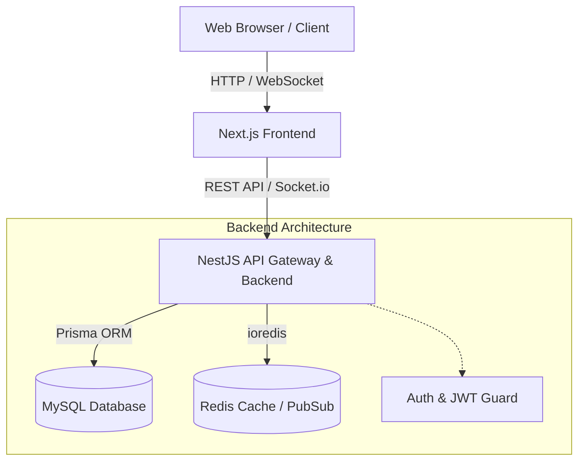

# 🏦 FinanceHub - Digital Banking Dashboard Simulator

<div align="center">


**A modern, enterprise-grade fintech dashboard simulator built for portfolio demonstration.**

**Author:** Mahmoud Bousbih

</div>

---

## 🎯 Overview

FinanceHub is a full-stack digital banking simulator that showcases modern fintech application development. It features a complete authentication system, multi-account management, interactive 3D virtual cards, real-time transfers, currency exchange, AI-driven insights, Smart Savings Vaults, and an admin supervision panel. It incorporates an ultra-premium "Glassmorphism" UI/UX to match high-end banking apps.

> ⚠️ **This is a simulator.** No real financial transactions are processed.

## ✨ Features

| Feature | Description |
|---------|-------------|
| 🔐 **Authentication & Security** | JWT, 2FA/OTP simulation, Active Sessions management, full Security Audit Logs |
| 💰 **Accounts & Vaults** | Multiple virtual accounts + Smart Savings Vaults with "Round-up" spare change |
| 💳 **3D Virtual Cards** | Interactive physics-based 3D cards, create, block, activate (Visa/Mastercard/Amex) |
| 💸 **Transfers & Split Bill** | Internal transfers with fee calculation and "Split the Bill" request tracking |
| 📊 **Dashboard & AI Insights** | Real-time financial overview with AI-generated Smart Tips and spending analytics |
| 📈 **Investments Portfolio** | Track simulated Crypto and Stocks (Mock API) with interactive charts |
| 💱 **Exchange** | Live currency conversion with 8 supported currencies |
| 🎁 **Rewards System** | Loyalty Tiers (Standard, Premium, Metal) and Cashback points tracking |
| 🔔 **Notifications** | In-app notifications with unread indicators and mock system events |
| 🛡️ **Admin Panel** | User management, audit logs, transaction supervision |
| 📱 **Responsive UI/UX** | Glassmorphism, Framer Motion animations, mobile/tablet/desktop support |

## 🛠️ Tech Stack

### Frontend
- **Next.js 14** (App Router) + **TypeScript**
- **TailwindCSS** + **shadcn/ui** components
- **Framer Motion** for 3D physics and smooth UI interactions
- **TanStack Query** for server state
- **Zustand** for client state
- **Recharts** for data visualization
- **Zod** + **React Hook Form** for validation
- **Socket.io** client for real-time

### Backend
- **NestJS** + **TypeScript**
- **Prisma ORM** + **MySQL**
- **Redis** for caching
- **JWT** authentication with refresh token rotation
- **Swagger/OpenAPI** documentation
- **Socket.io** for WebSocket
- **bcryptjs** for password hashing

### DevOps
- **Docker** + **Docker Compose**
- **GitHub Actions** CI/CD
- **Turborepo** monorepo management

## 📁 Project Structure

```
finance-dashboard/
├── apps/
│   ├── web/              # Next.js Frontend
│   │   └── src/
│   │       ├── app/      # Pages (App Router)
│   │       ├── components/  # UI Components
│   │       ├── lib/      # Utilities & API
│   │       └── store/    # Zustand stores
│   └── api/              # NestJS Backend
│       ├── prisma/       # Schema & migrations
│       └── src/
│           ├── common/   # Prisma, Redis
│           └── modules/  # Feature modules
├── docker/               # Docker configs
├── .github/workflows/    # CI/CD
└── docs/                 # Documentation
```

## 🏗️ Architecture Diagram



## 📸 Screenshots

> Below are previews of the main FinanceHub pages.  
> Each screenshot highlights a key part of the fintech experience.

### 1. Landing Page


### 2. Login Page


### 3. Full Dashboard — Dark Mode


### 4. Dashboard Overview


### 5. Accounts Page


### 6. Cards Page


### 7. Transfers Page


### 8. Transactions Page


### 9. Deposits & Withdrawals


### 10. Currency Exchange


### 11. Investments & Crypto


### 12. Smart Savings Vaults


### 13. Notifications Page


### 14. Profile Page


### 15. Settings & Security


## 🚀 Quick Start

### Prerequisites
- Node.js ≥ 18
- MySQL 8.0
- Redis 7+
- npm ≥ 9

### Option 1: Docker (Recommended)

```bash
# Clone and start
cd finance-dashboard
cp .env.example .env
docker compose -f docker/docker-compose.yml up -d

# Run migrations and seed
cd apps/api
npx prisma migrate dev
npx prisma db seed
```

### Option 2: Local Development

```bash
# 1. Install dependencies
cd finance-dashboard
npm install
cd apps/api && npm install
cd ../web && npm install

# 2. Setup database
cd apps/api
cp ../../.env.example .env
npx prisma generate
npx prisma migrate dev
npx prisma db seed

# 3. Start services
# Terminal 1 - API
cd apps/api && npm run dev

# Terminal 2 - Frontend
cd apps/web && npm run dev
```

### Access Points
| Service | URL |
|---------|-----|
| Frontend | http://localhost:3000 |
| API | http://localhost:3001 |
| Swagger Docs | http://localhost:3001/api/docs |
| Prisma Studio | `npx prisma studio` |

### Demo Credentials
| Role | Email | Password |
|------|-------|----------|
| Admin | admin@financehub.dev | Password@123 |
| User | john@example.com | Password@123 |
| User | sophie@example.com | Password@123 |
| User | ahmed@example.com | Password@123 |

## 🔑 API Endpoints

<details>
<summary>Click to expand all endpoints</summary>

### Auth
| Method | Endpoint | Description |
|--------|----------|-------------|
| POST | /api/v1/auth/signup | Create account |
| POST | /api/v1/auth/login | Login |
| POST | /api/v1/auth/logout | Logout |
| POST | /api/v1/auth/refresh | Refresh token |
| POST | /api/v1/auth/forgot-password | Request reset |
| POST | /api/v1/auth/reset-password | Reset password |

### Users
| Method | Endpoint | Description |
|--------|----------|-------------|
| GET | /api/v1/users/me | Get profile |
| PATCH | /api/v1/users/me | Update profile |
| PATCH | /api/v1/users/me/password | Change password |

### Accounts
| Method | Endpoint | Description |
|--------|----------|-------------|
| GET | /api/v1/accounts | List accounts |
| POST | /api/v1/accounts | Create account |
| GET | /api/v1/accounts/:id | Account details |
| PATCH | /api/v1/accounts/:id/status | Update status |

### Cards, Transfers, Transactions, Exchange, Notifications, Admin
Full documentation available at **/api/docs** (Swagger UI)

</details>

## 🗄️ Database Schema

The Prisma schema includes 15 models with proper relations, indexes, and constraints:
- User, RefreshToken, PasswordResetToken, EmailVerificationToken
- Account, Card, Beneficiary, Vault, SplitRequest
- Transfer, Transaction, Deposit, Withdrawal
- ExchangeRate, ExchangeHistory
- Notification, AuditLog

## 🔒 Security

- JWT access tokens (15min expiry)
- Refresh token rotation with hashed storage
- bcrypt password hashing (12 rounds)
- Rate limiting (100 req/60s)
- RBAC authorization guards
- Input validation with class-validator
- Helmet security headers
- CORS strict configuration
- Audit trail for sensitive actions
- No storage of CVV, raw PAN, or plain passwords

## 📝 License

MIT License - Built for portfolio demonstration purposes.
